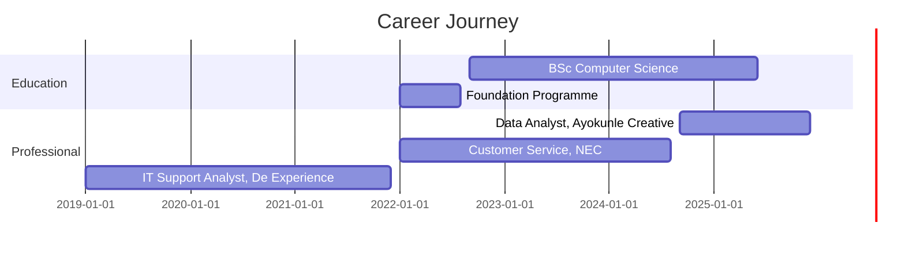

<div align="center">
  
</div>

<div align="center">

[](https://linkedin.com/in/henry-amadi)
[](mailto:amadichituga@hotmail.com)
[](https://henry-amadi.dev)
[](https://github.com/Henry-Amadi)

</div>

---

## 👨‍💻 Professional Summary

Motivated and detail-oriented **Computer Science Graduate** with strong expertise in **IT support, data analysis, and technology solutions**. Experienced in troubleshooting, data collection, and software application assistance, leveraging tools such as **SQL, Python, and Microsoft 365**. Proven track record in providing exceptional customer support, resolving technical incidents, and communicating data insights to both technical and non-technical audiences.

### 🚀 Quick Facts

```javascript
const henryAmadi = {
    location: "Birmingham, UK 🇬🇧",
    roles: ["Data Analyst", "IT Support Specialist", "Computer Science Graduate"],
    education: "BSc Computer Science - 2:1",
    university: "Birmingham City University",
    specializations: ["Data Analysis", "IT Support", "Technical Documentation"],
    certifications: ["Google Data Analytics", "Cisco Networking"],
    ticketsResolved: "50+ weekly",
    customerSatisfaction: "98%",
    firstContactResolution: "95%",
    passions: ["Data Insights", "Problem Solving", "Process Improvement", "Customer Excellence"],
    currentFocus: "Data Analytics & IT Support Solutions",
    availableFor: ["Data Analysis Roles", "IT Support Positions", "Technical Consulting"]
};
```

---


---

## 💻 Technical Arsenal

<details open>
<summary><b>📊 Data Analysis & Visualization</b></summary>
<br>


</details>

<details open>
<summary><b>🛠️ IT Support & Systems</b></summary>
<br>


</details>

<details open>
<summary><b>💻 Programming & Development</b></summary>
<br>


</details>

<details open>
<summary><b>🌐 Networking & Infrastructure</b></summary>
<br>


</details>

---

## 💼 Professional Experience



### 🎯 Current & Recent Roles

<table>
<tr>
<td width="50%">

**📊 Data Analyst & Administrative Support**  
*Ayokunle Creative Studio* | Jan 2019 – Dec 2021

**Key Responsibilities:**
- 📋 HR documentation and data management
- 🤝 Meeting coordination and minute-taking
- 📁 Compliance and employee lifecycle documentation
- 📝 Project documentation support

**Key Achievements:**
- ✅ Maintained comprehensive HR documentation systems
- ✅ Enhanced internal communication workflows
- ✅ Supported training and apprenticeship programs
- ✅ Ensured compliance with data confidentiality standards

</td>
<td width="50%">

**🎫 Customer Service & Front-of-House Assistant**  
*NEC, Birmingham* | Jan 2022 – Present

**Key Responsibilities:**
- 😊 Exceptional customer service delivery
- 📞 Query and complaint resolution
- 🎯 Order handling and accuracy
- 📊 Feedback documentation

**Key Achievements:**
- ✅ **98% customer satisfaction** score
- ✅ Handled high-volume customer interactions
- ✅ Maintained professionalism under pressure
- ✅ Accurate allergen tracking and documentation

</td>
</tr>
</table>

### 🏆 Previous Experience

**💻 IT & Helpdesk Support Analyst** | *De Experience Global Limited (Remote, Nigeria)* | Sep 2024 – Present

<table>
<tr>
<td width="50%">

**Responsibilities:**
- 🎫 Support ticket analysis and resolution
- 👥 Active Directory and M365 management
- 📝 Technical documentation
- 🔧 System troubleshooting
- 💬 User training and communication

</td>
<td width="50%">

**Key Achievements:**
- ✅ Resolved **50+ weekly tickets** with **95% first-contact resolution**
- ✅ Reduced onboarding time by **30%** through process improvements
- ✅ Built comprehensive knowledge base
- ✅ Enhanced system reliability through data-driven insights
- ✅ Maintained operational continuity for 200+ users

</td>
</tr>
</table>

---

## 🎯 Core Expertise

<table>
<tr>
<td width="25%" align="center">

### 📊 Data Analysis
- SQL Query Writing
- Python Data Processing
- Excel Advanced Functions
- Power BI Dashboards
- Data Visualization
- Statistical Analysis

</td>
<td width="25%" align="center">

### 💻 IT Support
- Helpdesk Management
- Active Directory
- Microsoft 365 Admin
- Remote Support
- System Troubleshooting
- User Account Management

</td>
<td width="25%" align="center">

### 🛠️ Technical Skills
- JIRA & Confluence
- Network Configuration
- Technical Documentation
- Process Improvement
- Knowledge Base Creation
- Incident Management

</td>
<td width="25%" align="center">

### 🤝 Soft Skills
- Customer Service
- Problem Solving
- Team Collaboration
- Clear Communication
- Attention to Detail
- Adaptability

</td>
</tr>
</table>

---

## 📊 Key Performance Metrics

<div align="center">

| Metric | Achievement | Context |
|--------|-------------|---------|
| 🎫 **Weekly Tickets Resolved** | 50+ | Consistent high-volume support delivery |
| ✅ **First-Contact Resolution** | 95% | Efficient problem-solving and user satisfaction |
| 😊 **Customer Satisfaction** | 98% | Excellence in customer service delivery |
| ⏱️ **Onboarding Time Reduction** | 30% | Process optimization through data-driven improvements |
| 👥 **Users Supported** | 200+ | Large-scale IT support management |
| 📚 **Knowledge Base Articles** | 50+ | Comprehensive technical documentation |

</div>

---

## 📊 GitHub Analytics

<div align="center">

  
  

</div>

<div align="center">

  

</div>

<div align="center">

  

</div>

<div align="center">

### 📈 Contribution Stats


</div>

---

## 🎓 Education & Certifications

**🎓 BSc Computer Science** - **Grade: 2:1**  
*Birmingham City University, Birmingham, UK* | Sept 2022 - June 2025
- Strong foundation in computer science principles and applications
- Focus on data structures, algorithms, and software development
- Practical experience in programming and system design

**🎓 Foundation in Film and Technology/Computing Networks and Games Technology**  
*Birmingham City University International College* | Jan 2022 - Aug 2022
- Preparatory studies for degree-level computer science
- Introduction to computing networks and technology fundamentals

### 📜 Professional Certifications

<div align="center">

| Certification | Provider | Year | Skills Acquired |
|--------------|----------|------|-----------------|
| 🏆 **Google Data Analytics Professional Certificate** | Google | 2024 | Data Analysis, SQL, Spreadsheets, Tableau, R Programming |
| 🌐 **Cisco Networking** | Cisco | 2023 | Network Configuration, Troubleshooting, Security, Routing & Switching |

</div>

---

## 💡 Featured Projects & Contributions

<table>
<tr>
<td width="50%" align="center">

### 📊 Data Analysis Portfolio
**Customer Support Analysis Dashboard**


Analyzing support ticket trends and patterns using Python and Power BI to identify areas for service improvement.

**Stack:** `Python` `SQL` `Power BI` `Excel`

**Key Features:**
- Ticket volume analysis
- Resolution time tracking
- Customer satisfaction metrics
- Trend identification

</td>
<td width="50%" align="center">

### 💻 IT Support Documentation
**Technical Knowledge Base**


Comprehensive technical documentation and troubleshooting guides for common IT support scenarios.

**Stack:** `Confluence` `JIRA` `Markdown`

**Impact:**
- 50+ documented solutions
- 40% reduction in repeat tickets
- Improved team efficiency

</td>
</tr>

<tr>
<td width="50%" align="center">

### 🔧 Process Improvement Project
**Onboarding Automation**


Streamlined employee onboarding process through automation and standardization.

**Stack:** `PowerShell` `Active Directory` `M365`

**Results:**
- 30% time reduction
- Improved accuracy
- Enhanced user experience

</td>
<td width="50%" align="center">

### 📈 Data Visualization
**HR Analytics Dashboard**


Interactive dashboard for HR metrics and employee lifecycle tracking.

**Stack:** `Python` `Pandas` `Matplotlib` `Excel`

**Features:**
- Employee data tracking
- Compliance monitoring
- Visual reporting

</td>
</tr>
</table>

---

## 🌱 Currently Working On

- 📊 **Advanced Data Analytics Projects** - Building comprehensive analytics dashboards using Python and Power BI
- 🎓 **Professional Development** - Pursuing additional certifications in cloud computing and data science
- 💻 **Open Source Contributions** - Contributing to data analysis and IT automation projects
- 📚 **Technical Blog** - Documenting learnings in data analysis and IT support best practices
- 🔧 **Automation Scripts** - Developing Python scripts for IT support process automation
- 🌐 **Personal Portfolio Website** - Showcasing projects and professional achievements

---

## 💡 What I Bring to the Table

<table>
<tr>
<td width="50%">

### 🎯 Technical Excellence
- **Data Analysis** expertise with Python and SQL
- **IT Support** with 95% first-contact resolution
- **Microsoft 365** and Active Directory proficiency
- **Process Improvement** through data-driven insights
- **Customer-centric** approach to problem-solving

</td>
<td width="50%">

### 🤝 Professional Attributes
- **Strong analytical** and problem-solving skills
- **Excellent communication** with technical and non-technical audiences
- **Team collaboration** and cross-functional coordination
- **Attention to detail** in documentation and processes
- **Continuous learning** mindset and adaptability

</td>
</tr>
</table>

---

## 🏆 Key Achievements

<div align="center">

| Achievement | Year | Impact |
|------------|------|--------|
| 🎓 **BSc Computer Science (2:1)** | 2025 | Strong academic foundation in computer science |
| 🏅 **98% Customer Satisfaction** | 2022-2024 | Exceptional service delivery at NEC Birmingham |
| 💻 **50+ Weekly Tickets Resolved** | 2019-2021 | Consistent high-volume support performance |
| ⚡ **95% First-Contact Resolution** | 2019-2021 | Efficient problem-solving and user satisfaction |
| 📈 **30% Onboarding Improvement** | 2020 | Process optimization through automation |
| 📚 **50+ Knowledge Base Articles** | 2019-2021 | Comprehensive technical documentation |
| 🎖️ **Google Data Analytics Certified** | 2024 | Professional certification in data analysis |
| 🌐 **Cisco Networking Certified** | 2023 | Network configuration and security expertise |

</div>

---

## 🤝 Open to Collaborate On

- 📊 **Data Analysis Projects** - Business intelligence, data visualization, and insights generation
- 💻 **IT Support Solutions** - Helpdesk automation, process improvement, and technical documentation
- 🔧 **Process Automation** - Python scripts for IT operations and data processing
- 📈 **Analytics Dashboards** - Power BI and Python-based reporting solutions
- 🌐 **Open Source Projects** - Data analysis tools and IT support utilities
- 📚 **Technical Writing** - Documentation, tutorials, and best practice guides
- 🎓 **Knowledge Sharing** - Mentoring aspiring IT professionals and data analysts

---

## 📫 Let's Connect & Collaborate

<div align="center">

[](mailto:amadichituga@hotmail.com)
[7471796394-25D366?style=for-the-badge&logo=whatsapp&logoColor=white)](tel:+447471796394)
[](https://linkedin.com/in/henry-amadi)
[](https://henry-amadi.dev)

**📍 Location:** Birmingham, UK 🇬🇧  
**🌍 Timezone:** GMT (UTC+0)  
**💼 Available for:** Full-time • Contract • Freelance Opportunities

</div>

---

## 📈 Professional Interests

<div align="center">

**Data Analytics** • **IT Support** • **Business Intelligence** • **Process Automation**  
**Technical Documentation** • **Customer Service Excellence** • **System Administration**  
**Network Security** • **Cloud Computing** • **Problem Solving**

</div>

---

<div align="center">

### 💡 "Transforming data into actionable insights and solving technical challenges with precision"

### 🎯 Let's Connect and Create Value Together!


[](https://github.com/Henry-Amadi)

**⭐️ If you find my work interesting, consider connecting or starring some repositories!**

---


*Last Updated: October 2025*

</div>
